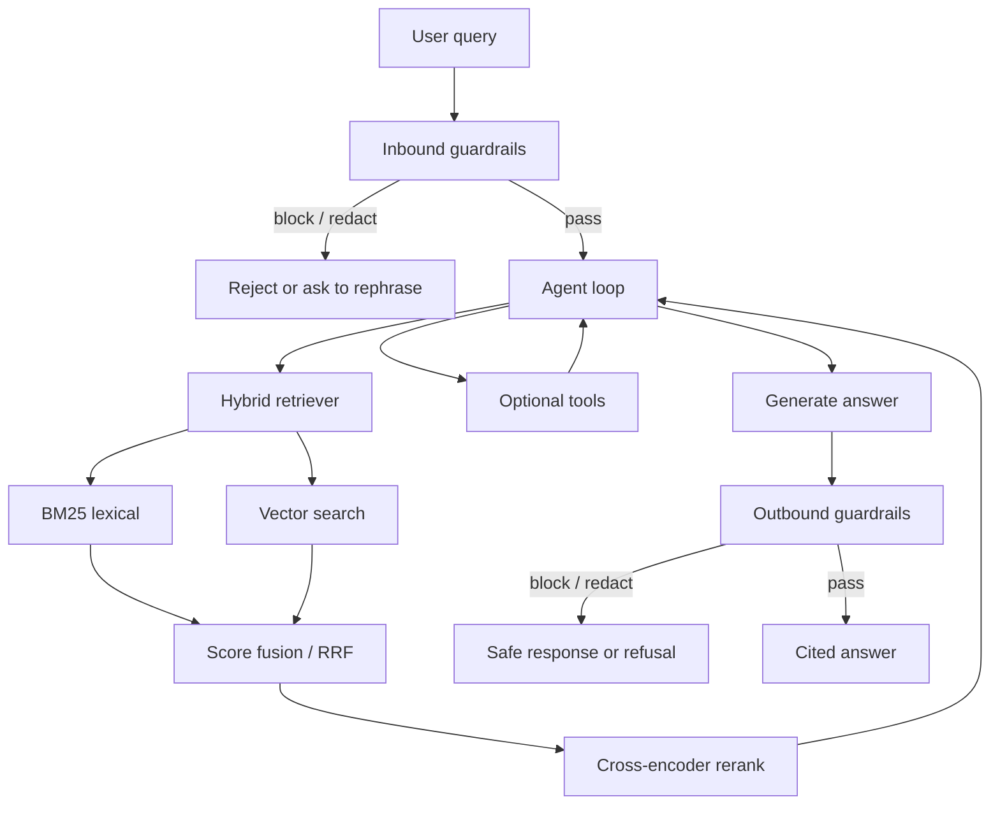

# Agentic RAG

Enterprise retrieval-augmented generation with hybrid search (BM25 + vector), cross-encoder reranking, and bidirectional guardrails.

Built for internal knowledge bases where naive top-k embedding search misses exact identifiers, and unfiltered generation is not an option.

## Problem

Naive RAG — embed the query, take the nearest chunks, stuff them into a prompt — fails in enterprise settings:

- **Lexical misses** — ticket IDs, SKUs, error codes, and policy names are sparse. Dense retrieval alone drops them.
- **Noisy context** — the nearest 20 chunks are often near-duplicates or off-topic. The model hallucinates around the wrong passage.
- **One-way safety** — teams filter the user prompt and ignore what the model emits (PII in retrieved HR docs, policy-violating answers).
- **No agent loop** — a single retrieve-then-generate pass cannot reformulate a bad query, fetch a missing doc, or call a tool.

Agentic RAG treats retrieval as a tool the model can call, ranks with a hybrid + rerank stack, and runs guardrails on both the inbound query and the outbound answer.

## Architecture Diagram



Ingest path (not shown): documents are chunked with overlap, indexed into a BM25 store and a vector index, and tagged with ACL / source metadata used at query time.

## Quickstart

```bash
git clone https://github.com/benvind/agentic-rag.git
cd agentic-rag

cp .env.example .env
# Set EMBEDDING_MODEL, RERANK_MODEL, LLM_BASE_URL, VECTOR_URI

docker compose up --build
# API on http://localhost:8000
```

Index a corpus, then ask a question:

```bash
curl -s http://localhost:8000/v1/ingest \
  -H "Content-Type: application/json" \
  -d '{"path": "./data/policies"}'

curl -s http://localhost:8000/v1/ask \
  -H "Content-Type: application/json" \
  -d '{
    "query": "What is the retention period for access logs?",
    "top_k": 20,
    "rerank_k": 5
  }'
```

Python (no Docker):

```bash
python -m venv .venv && source .venv/bin/activate
pip install -e ".[dev]"
uvicorn src.rag.app:app --reload --port 8000
```

## Design Decisions (ADRs)

Decisions that would otherwise live in `docs/adr/`. Summaries below; full write-ups land there as the code grows.

### ADR-001 — Hybrid search, not vector-only

**Status:** Accepted

**Context:** Embedding search is strong on paraphrase and weak on exact tokens. Enterprise corpora are full of identifiers and controlled vocabulary.

**Decision:** Retrieve independently from BM25 and a vector index, then fuse with Reciprocal Rank Fusion (RRF) before reranking. `top_k` is taken from the fused list, not from either channel alone.

**Consequences:** Two indexes to keep in sync. Ingest must write both. Query latency is `max(bm25, vector)` plus fusion, which is cheap.

### ADR-002 — Cross-encoder reranking after fusion

**Status:** Accepted

**Context:** Bi-encoders and BM25 optimize recall. Precision at the prompt window is what actually reduces hallucinations.

**Decision:** Run a cross-encoder over the fused candidates (e.g. 20 → 5). Only the reranked slice is visible to the generator. The agent may issue a second retrieve if scores are below a threshold.

**Consequences:** A GPU- or CPU-bound rerank step on the query path. Batch the pairs. Keep `rerank_k` small. Log scores so evaluation can measure nDCG@k separately from generation quality.

### ADR-003 — Bidirectional guardrails

**Status:** Accepted

**Context:** Input filters do not stop a model from quoting a salary band, a customer email, or a disallowed instruction found in retrieved text.

**Decision:** The same policy family runs twice: inbound (prompt injection, PII in the question, topic allow/deny) and outbound (PII in the answer, groundedness / citation check, policy refusal). Retrieval itself is ACL-filtered so the model never sees unauthorized chunks.

**Consequences:** Outbound checks add latency after generation. Streaming must buffer enough text to apply redaction, or stream and then amend. Fail-closed on safety-critical policies.

### ADR-004 — Agent loop with retrieval as a tool

**Status:** Accepted

**Context:** A single-shot RAG pipeline cannot recover from a poor first query or pull a table the first chunker split badly.

**Decision:** Expose `search`, `read_document`, and (optionally) structured tools. Bound the loop (max steps, token budget). Prefer retrieve → rerank → answer; escalate to extra tool calls only when rerank scores or a critic signal say the evidence is thin.

**Consequences:** Higher p99 latency and cost on hard questions. Need traces per step for eval and debugging. Must cap loops to prevent runaway spend.

## Benchmarks

Figures below are **targets and lab methodology**, not production SLAs. Replace with measured numbers once `benchmarks/` and a labeled eval set exist.

| Scenario | Metric | Target |
| --- | --- | --- |
| Hybrid vs vector-only on identifier queries | Recall@20 | Hybrid ≥ +15 pp |
| Cross-encoder rerank | nDCG@5 vs fused-only | ≥ +0.08 |
| End-to-end answer quality | Faithfulness / citation precision (LLM-as-judge + human spot check) | ≥ 0.85 |
| Inbound guardrail | PII / injection catch rate on red-team set | ≥ 95% recall, ≤ 5% false block |
| Outbound guardrail | Leaked-PII rate on held-out docs | 0 on block-mode policies |
| Query path | p50 retrieve + rerank (excluding LLM) | < 200 ms on 1M-chunk index |

Reproduce (once the bench suite exists):

```bash
python -m benchmarks.run --suite retrieval --dataset data/eval/enterprise_qa.jsonl
python -m benchmarks.run --suite guardrails --dataset data/eval/redteam.jsonl
```

## Status

Scaffold. Architecture and ADRs are in place so implementation can land without inventing the public story later.
