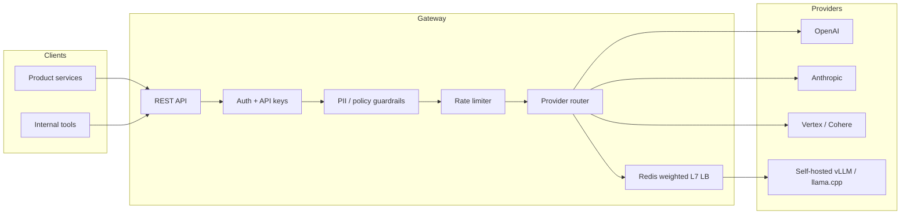

# AI Gateway

Multi-provider LLM gateway with provider abstraction, PII guardrails, rate limiting, and Redis load balancing.

A production-shaped control plane for LLM traffic: one API in front of many providers, with safety, quotas, and routing enforced before a token is spent.

## Problem

Product teams do not want to integrate OpenAI, Anthropic, Vertex, Cohere, and self-hosted models independently. Doing so creates:

- **Provider lock-in** — request/response shapes, auth, retries, and streaming all differ.
- **Ungoverned spend and abuse** — no shared rate limits, credits, or audit trail.
- **Inconsistent safety** — PII, prompt injection, and policy checks are reimplemented (or skipped) per team.
- **Wasted GPU capacity** — internally hosted models have no shared load balancer, so some replicas sit idle while others queue.

AI Gateway is the single ingress for LLM calls. Applications speak one contract. The gateway handles provider translation, guardrails, rate limiting, and weighted routing.

## Architecture Diagram



Request path: authenticate → run the guardrail chain → apply tenant rate limits → select a provider (or a weighted self-hosted replica) → translate the request → stream or return the response → emit usage, cost, and safety telemetry.

## Quickstart

```bash
git clone https://github.com/benvind/ai-gateway.git
cd ai-gateway

cp .env.example .env
# Set OPENAI_API_KEY, ANTHROPIC_API_KEY, REDIS_URL

docker compose up --build
# Gateway listens on http://localhost:8080
```

```bash
curl -s http://localhost:8080/v1/chat/completions \
  -H "Authorization: Bearer $GATEWAY_API_KEY" \
  -H "Content-Type: application/json" \
  -d '{
    "model": "auto",
    "messages": [{"role": "user", "content": "Summarize our rate-limit policy."}]
  }'
```

Python (no Docker):

```bash
python -m venv .venv && source .venv/bin/activate
pip install -e ".[dev]"
uvicorn src.gateway.app:app --reload --port 8080
```

## Design Decisions (ADRs)

Decisions that would otherwise live in `docs/adr/`. Summaries below; full write-ups land there as the code grows.

### ADR-001 — Provider abstraction over a unified V2 API

**Status:** Accepted

**Context:** Each vendor SDK has a different auth model, tool-calling schema, and streaming protocol. Teams were copying SDKs into services.

**Decision:** Expose one OpenAI-compatible surface (`/v1/chat/completions`, embeddings, models). Behind it, a `Provider` interface maps to OpenAI, Anthropic, Vertex, Cohere, and self-hosted OpenAI-compatible backends.

**Consequences:** New providers are an adapter, not a new public API. Streaming and tool calling must be normalized in the adapter. Some vendor-only features stay behind explicit extension fields.

### ADR-002 — Guardrails as a Chain of Responsibility

**Status:** Accepted

**Context:** Safety checks (PII mask/flag/block, topic filters, regex denylist, abuse signals) change independently and must stay model-agnostic.

**Decision:** Run an ordered pipeline of guardrail handlers. Each handler can pass, transform (e.g. mask PII), or short-circuit (block). The same chain can run on input and, where needed, on output.

**Consequences:** New policies are a new handler plus config, not a gateway rewrite. Ordering and fail-open vs fail-closed are explicit per handler.

### ADR-003 — Redis for rate limits and weighted L7 load balancing

**Status:** Accepted

**Context:** The gateway is horizontally scaled. In-process counters cannot enforce tenant quotas or share replica weights. Self-hosted GPUs need weighted routing so busier replicas receive less traffic.

**Decision:** Store sliding-window / token-bucket state and replica weights in Redis. The load balancer is L7: it sees model id, tenant, and replica health, then picks a backend.

**Consequences:** Redis is on the hot path. Availability of Redis must be treated as a platform dependency (timeouts, fail policy, local cache for weights).

### ADR-004 — Credits and observability are first-class, not afterthoughts

**Status:** Accepted

**Context:** A gateway without attribution becomes an unbounded cost center. A gateway without traces cannot debug safety blocks or provider errors.

**Decision:** Every request records tokens, estimated cost, provider, model, latency, guardrail actions, and error class. Credits (purchase, deduction, expiry) are a pluggable module, not hardcoded to one billing system.

**Consequences:** Slightly higher write amplification. Downstream product consoles can be built on the same event stream.

## Benchmarks

Figures below are **targets and lab methodology**, not production SLAs. Replace with measured numbers once the harness in `benchmarks/` is wired up.

| Scenario | Method | Target |
| --- | --- | --- |
| Chat completion, cached provider, p50 latency | `hey` / locust against local compose | < 25 ms gateway overhead |
| Chat completion, p99 latency | Same, 100 concurrent connections | < 80 ms gateway overhead |
| Rate-limiter decision | Redis token bucket, 10k rps | < 2 ms p99 |
| Weighted LB pick | Redis replica weights, 10k rps | < 1 ms p99 |
| PII guardrail (input) | Regex + detector on 2 KB prompt | < 5 ms p50 |
| Streaming TTFB | SSE through gateway vs direct provider | < 15 ms added TTFB |

Reproduce (once the bench suite exists):

```bash
docker compose -f docker-compose.bench.yml up -d
python -m benchmarks.run --scenario gateway_overhead --requests 10000 --concurrency 100
```

## Status

Scaffold. Architecture and ADRs are in place so implementation can land without inventing the public story later.
